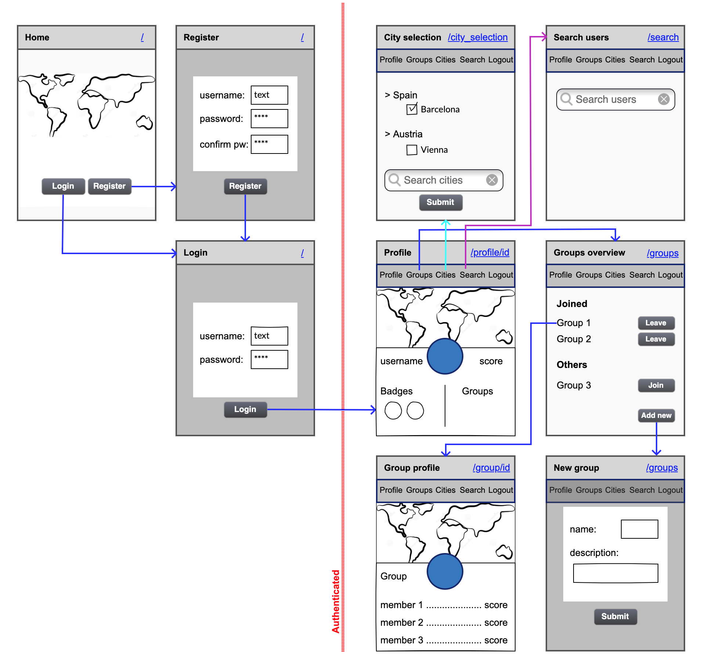
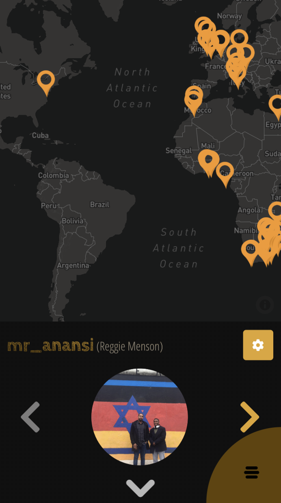
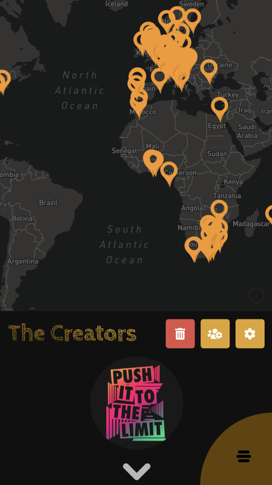
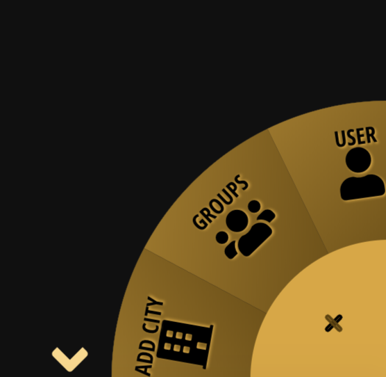
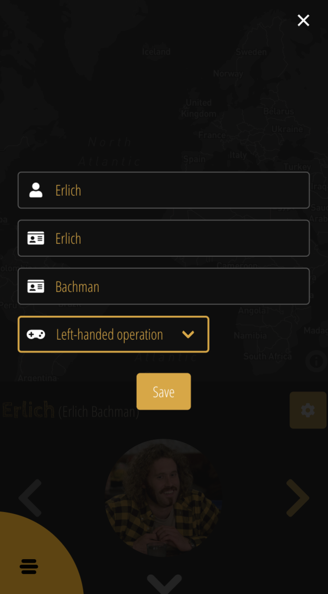
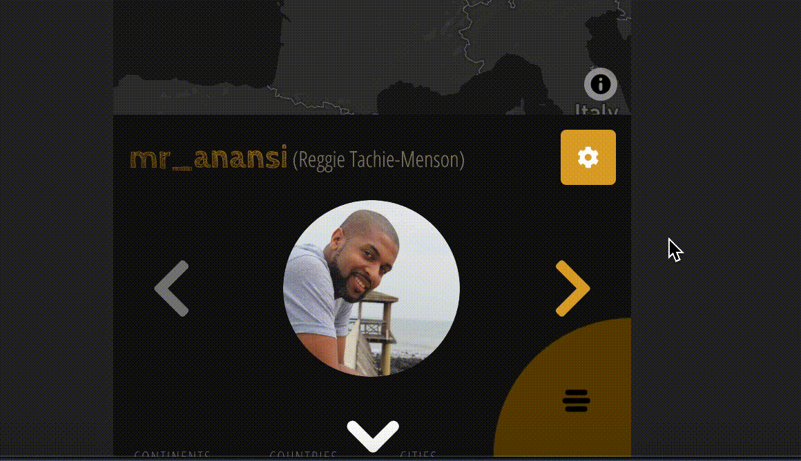
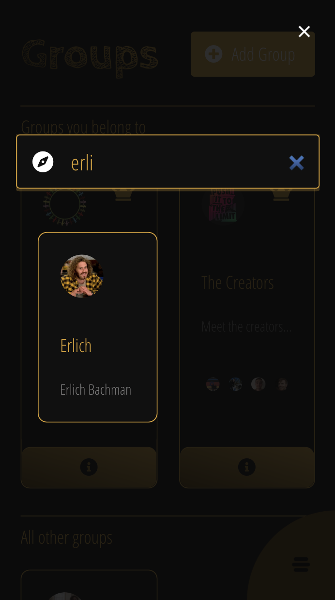
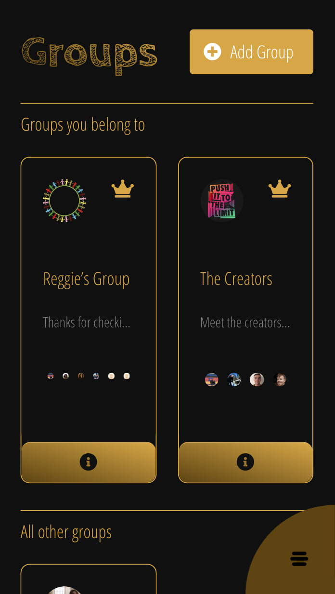

# TripBit
by [Michael Adair](https://github.com/mjadair), [Kathrin Eichinger](https://github.com/katheich), [Georg Preuss](https://github.com/georgpreuss) and [Reggie Tachie-Menson](https://github.com/reggiemenson)

## Overview

This is the final project of the software engineering immersive course at GA London. The assignment was to create a **full-stack application** within **one week**, and we chose to complete it in a **team of four**. 

TripBit is a platform inspired by analogue scratch maps, where people scratch out the countries they have visited. Users select the cities they have travelled to, are assigned a travel score and can earn badges for certain achievements. They can also create and join groups to compare their travels with friends more directly. All of this is achieved by using the Django REST framework with a PostgreSQL database and a React front-end.

You can launch the app on Heroku [here](https://tripbit4.herokuapp.com/), or find the GitHub repo [here](https://github.com/mr-anansi/tripbit).

## Table of contents
1. [Brief](#Brief)
2. [Technologies used](#Technologies-used)
3. [Approach](#Approach)
    - [Planning](#Planning)
    - [Back-end](#Back-end)
    - [Front-end](#Front-end)
    - [File Structure](#File-structure)
4. [Additional Screenshots](#Screenshots)
5. [Potential future features](#Potential-future-features)
6. [Bugs](#Bugs)
7. [Lessons learned](#Lessons-learned)
8. [Credit](#credit)


## Brief

* Choose to work solo or in a team
* **Build a full-stack application** by making your own backend and your own front-end
* **Use a Python Django API** using Django REST Framework to serve your data from a Postgres database
* **Consume your API with a separate front-end** built with React
* **Be a complete product** which most likely means multiple relationships and CRUD functionality for at least a couple of models
* **Implement thoughtful user stories/wireframes** that are significant enough to help you know which features are core MVP and which you can cut
* **Have a visually impressive design** to kick your portfolio up a notch and have something to wow future clients & employers. 
* **Be deployed online** so it's publicly accessible.


## Technologies used
- HTML
- SCSS
- Python
- Django
- PostgreSQL
- JavaScript (ES6)
- React.js
- React Map GL (Mapbox)
- FileStack React
- React Toastify
- Webpack
- Dotenv
- Heroku
- Git and GitHub
- Trello
- Bulma
- Google Fonts
- Adobe Photoshop Elements

## Approach

### Planning

- On the first day we came up with the idea of the app and the wireframes for the main pages.


- We also planned out the models and end points that we would need on the back-end and divided the tasks among us using Trello.


### Back-end

**Models**

- For the PostgreSQL database, we set up four tables: Users, Towns, Badges and Groups.

- For the users, we extended the basic User provided by Django to include the following extra fields: email, profile image (with a default so it was not necessary to register), score (starting at the default of 0), dexterity (determining whether the navbar is located on the right or left-hand side of the screen), first and last name.

  ```py
  class User(AbstractUser):

    ORIENTATION = (
        ('LH', 'Left-Handed'),
        ('RH', 'Right-Handed'),
    )

    email = models.CharField(max_length=50, unique=True)
    image = models.CharField(max_length=500, default='https://bit.ly/37UONby')
    score = models.IntegerField(default=0)
    dexterity = models.CharField(max_length=2, choices=ORIENTATION, default='RH')
    first_name = models.CharField(max_length=100)
    last_name = models.CharField(max_length=100)
  ```

- For the towns, we relied on the World Cities Database provided by Simplemaps, and so used the same fields as were available in that dataset. 

  - We reduced the dataset by considering only towns with more than 80,000 inhabitants. We then read the resulting .csv file into our PostgreSQL database using the terminal (as shown below). Once the data was read in, we created a fixtures.json file that would easily re-seed the database in the format we needed.

  ```py
  python manage.py shell

    import csv
    from travels.models import Town

    with open('./travels/db/worldcities_clean.csv') as csvfile:
      reader = csv.reader(csvfile, delimiter=";")
      for row in reader:
        p = Town(name = row[0], name_ascii = row[1], lat = row[2], lng = row[3], country = row[4], iso2 = row[5], iso3 = row[6], admin_name = row[7], capital = row[8], population = row[9], continent=row[11])
        p.save()
  ```
    - In addition to the info provided by the database, the towns also had a **many-to-many** relationship to users, showing the visitors that have been to each town.

  ```py
  class Town(models.Model):
    name = models.CharField(max_length=255)
    name_ascii = models.CharField(max_length=255)
    lat = models.CharField(max_length=255)
    lng = models.CharField(max_length=255)
    country = models.CharField(max_length=255)
    iso2 = models.CharField(max_length=255, null=True)
    iso3 = models.CharField(max_length=255, null=True)
    admin_name = models.CharField(max_length=255, null=True)
    capital = models.CharField(max_length=255, null=True)
    population = models.IntegerField(null=True)
    continent = models.CharField(max_length=255)
    visitors = models.ManyToManyField(
        User,
        related_name='towns',
        blank=True
    )

    def __str__(self):
        return f'{self.name} - {self.country}'
  ```

- For the badges, we similarly created a csv file outlining the names, descriptions and links to the images that we wanted to use, that was then read into the database via the terminal the same way as the towns data and eventually added to the fixtures file. Additionally, the badges also have a **many-to-many** relationship to users, showing all the users that have earned a given badge.

  ```py
  class Badge(models.Model):
    name = models.CharField(max_length=50)
    description = models.CharField(max_length=300)
    image = models.CharField(max_length=100)
    users = models.ManyToManyField(
        User,
        related_name='badges',
        blank=True
    )

    def __str__(self):
        return f'{self.name}'
  ```

- For the groups, we only needed the basic fields of name, description and image, plus the following relationships to the User model: 1) a **one-to-many** relationship signifying the owner of the group, 2) a **many-to-many** relationship tracking the members of each group, and 3) another **many-to-many** relationship tracking the users that have requested membership of a group but have not yet been approved by the owner.

  ```py
  class Group(models.Model):

    name = models.CharField(max_length=50)
    description = models.CharField(max_length=300)
    image = models.CharField(max_length=500, default='https://cdn.pixabay.com/photo/2014/04/02/10/47/globe-304586_1280.png')
    owner = models.ForeignKey(
        User,
        related_name='groups_owned',
        on_delete=models.CASCADE,
        default=1
    )
    members = models.ManyToManyField(
        User,
        related_name='groups_joined',
        blank=True
    )
    requests = models.ManyToManyField(
        User,
        related_name='groups_requested',
        blank=True
    )

    def __str__(self):
        return f'{self.name}'
  ```

**API End-points**

#### 1. User	

<table >
  <tr>
    <th></th>
    <th>GET</th>
    <th>POST</th>
    <th>PUT</th>
    <th>DELETE</th>
  </tr>
  <tr>
    <td>/register</td>
    <td></td>
    <td>X</td>
    <td></td>
    <td></td>
  </tr>
  <tr>
    <td>/login</td>
    <td></td>
    <td>X</td>
    <td></td>
    <td></td>
  </tr>
  <tr>
    <td>/users</td>
    <td>X</td>
    <td></td>
    <td></td>
    <td></td>
  </tr>
  <tr>
    <td>/profile/&lt;int:pk&gt;</td>
    <td>X</td>
    <td></td>
    <td></td>
    <td></td>
  </tr>
  <tr>
    <td>/profile</td>
    <td>X</td>
    <td></td>
    <td>X</td>
    <td>X</td>
  </tr>
  <tr>
    <td>/profile/edit/all</td>
    <td></td>
    <td></td>
    <td>X</td>
    <td></td>
  </tr>
</table>

- `/register` only has a post route, where the user's data is received and stored in the database.
- Similarly, `/login` only has a post route, where the user's login information is received, checked and, if valid, a JWT token is returned as response.
- `/users` is a simple GET route, that provides a full list of users to allow searching for other users to access their profiles.
- `/profile/<int:pk>/` similarly only has a GET route to fetch a specific user profile to be displayed.
- `/profile` has a GET, PUT and DELETE route, all relating to the user data of the user currently logged in, allowing them to respectively fetch, amend and delete their profile information.
- `/profile/edit/all` is the most complex part of the platform, even though it only involves a PUT route. This is the route via which a user adds towns that they have visited to their profile, setting off a chain-reaction:
  - The route is set up to always receive the full list of towns a given user has visited. These towns are added to the user in the database.
  - Given this list of towns, the badges that the user has earned are determined. This is done via bespoke functions for each type of badge in the database, for instance the 'Columbus badge' (with ID 209 in the database) is determined as follows:

    ```py
    all_user_countries = list(map(lambda town: town['country'], towns))
    unique_user_countries = set(all_user_countries)
    unique_continents = set(map(lambda town: town['continent'], towns))

    # Columbus (209)
    if 'Portugal' in unique_user_countries and 'Spain' in unique_user_countries and 'South America' in unique_continents:
        badge_ids.append(209)
    ```
  - Once this individual user's new badges have been allocated, the badges that rely on comparing information across users are re-assessed: checking which user has visited the most cities, countries, continents and earned the most badges. These users are saved to the badges directly.
  - Following this, we return to the individual user who posted new towns, whose score is now determined, adding 5 XP per town, 10 XP per capital, 20 XP per country and 50 XP per continent visited.
  - All of this new information is added to the user profile, which is then finally saved in the database.


#### 2. Town

<table >
  <tr>
    <th></th>
    <th>GET</th>
    <th>POST</th>
    <th>PUT</th>
    <th>DELETE</th>
  </tr>
  <tr>
    <td>/towns</td>
    <td>X</td>
    <td></td>
    <td></td>
    <td></td>
  </tr>
  </table>

- `/towns` only has a GET route, since the town data is only displayed and never amended directly. It was a conscious choice to have users only add towns they have visited via the `/profile/edit/all` route outlined above, in order to ensure that all the other information that depended on the list of towns would always be updated correctly.

#### 3. Badge

<table >
  <tr>
    <th></th>
    <th>GET</th>
    <th>POST</th>
    <th>PUT</th>
    <th>DELETE</th>
  </tr>
  <tr>
    <td>/badges</td>
    <td>X</td>
    <td></td>
    <td></td>
    <td></td>
  </tr>
  <tr>
    <td>/badges/&lt;int:pk&gt;/</td>
    <td>X</td>
    <td></td>
    <td></td>
    <td></td>
  </tr>
  </table>

- `/badges` and `/badges/<int:pk>` similarly only involve simple GET routes, allowing the display of all badges, as well as of one specific badge at a time, since the badge information itself is immutable in our database and badges are allocated to users via the `/profile/edit/all` route outlined above. In fact, we did not end up using these routes at all.

#### 4. Group

<table >
  <tr>
    <th></th>
    <th>GET</th>
    <th>POST</th>
    <th>PUT</th>
    <th>DELETE</th>
  </tr>
  <tr>
    <td>/groups</td>
    <td>X</td>
    <td>X</td>
    <td></td>
    <td></td>
  </tr>
  <tr>
    <td>/groups/&lt;int:pk&gt;/</td>
    <td>X</td>
    <td></td>
    <td>X</td>
    <td>X</td>
  </tr>
  <tr>
    <td>/groups/&lt;int:pk&gt;/membership</td>
    <td>X</td>
    <td></td>
    <td>X</td>
    <td>X</td>
  </tr>
  </table>

- `/groups` has both a GET and a POST route, the former allowing to see all group information in the database and the latter allowing the posting of a new group to the platform. The user who posted the group automatically becomes that group's owner.
- `/groups/<int:pk>` has a publicly accessible GET route, allowing the info of a specific group to be displayed. It also has a PUT and DELETE route, which allow the owner of the group to amend and delete the group information from the platform respectively.
- `/groups/<int:pk>/membership` similarly has a GET, PUT and DELETE route, which do the following:
  - The GET route allows any user not affiliated with the group to request membership of the group. This will add the user to the 'requests' field of the Group model.
  - The PUT route allows the owner of the group to specify the ID of one of the user's in the list of requests, which will approve that user's membership and move them to the 'members' field of the group.
  - The DELETE route allows a member to remove themselves from the group, or the owner of the group to remove a specific member from the group, again by specifying the ID of the member to be removed.

### Front-end

**Homepage/Map page**

.png)

- The hompage and map page use the same svg world map. The base file was obtained from amCharts, who provided the paths of the SVG with country name labels. Based on these, the colouring could be done conditionally on these names checking against the data from the back-end, for example the path for Great Britain is the following:

  ```js
  <g className="country">
    <path 
      (...) 
      className={countries.includes('GB') ? 'amcharts-map-area visited' : 'amcharts-map-area'}> 
    </path>
    <text className="label" x="0" y="-225">
      United Kingdom: {displayText('GB')}
    </text>
  </g>  
  ```
  - The `displayText()` function was created to have more flexibility regarding the information shown. For the simpler homepage, this looks as follows:

  ```js
  function displayText(country) {
    const num = countriesData[country]
    if (num > 1) {
      return `${num} visitors`
    } else if (num === 1){
      return `${num} visitor`
    } else {
      return 'unexplored'
    }
  }
  ```

**User/Group Profiles**

- The user and group profile pages largely have the same features and therefore follow the same structure.

 

- Both user and group profiles are largely made up of a map using React Map GL, showing all the towns that the user / group members have visited. The component calculates the midpoint of all these locations and centers the map accordingly:

  ```js
  const midCoordinate = (towns) => {

    const arrLats = towns.map((town) => {
      return parseFloat(town.lat.replace(',', '.'))
    })
    const maxLat = Math.max(...arrLats)
    const minLat = Math.min(...arrLats)
    const midLat = (maxLat + minLat) / 2

    const arrLngs = towns.map((town) => {
      return parseFloat(town.lng.replace(',', '.'))
    })
    const maxLng = Math.max(...arrLngs)
    const minLng = Math.min(...arrLngs)
    const midLng = (maxLng + minLng) / 2

    setViewport({ latitude: midLat, longitude: midLng, zoom: 1 })
  }
  ```

- We allow users to upload profile images and group images using the FileStack API. The image uploaded via this interface is saved with FileStack, which returns a link to the file on their servers, which is in turn saved in our database.

- For the user pages, we also display the badges. The images saved on the back-end do not have any specific styling, so we added the crayon mask above to make it look like they were 'scratched' off.

- The user profile also has an edit button, that allows the user to edit their personal information.

- The group profile has a different set of buttons depending on who is viewing the group:

  - The owner of group has the ability to edit, manage members and delete the grouop.
  - A member of the group has the option to leave the group.
  - A user who has requested access sees a pending symbol.
  - A user who is entirely unaffiliated to the group can request to become a member.

**City selection**

- The component always keeps a complete list of towns visited in state, querying the initial list when it is mounted from the API and updating as the user checks or unchecks cities.

- The 'done' button on this page is the only place where editing of towns occurs, i.e. the only place to go the `/profile/edit/all` route outlined in the back-end section above

.png)

**Navbar**

- Took the original from Zed Dash and adapted it for our purposes using pure CSS.

 

- Allow different positioning based on the dexterity the user indicated in their registration, moving the navbar to the bottom right or left corner accordingly.



**Search bar**

- We wanted to have the searchbar available on every page, and therefore placed it in a Modal (from Bulma) on the root app.js file. The Search icon of the navbar hence simply toggles said modal.

- As we are using the React Hashrouter, we also needed to add a redirection to user profiles to ensure that if the search was called on a profile route, this was still recognised as a different route, we therefore link to profiles from the seach via the following: 
  ```js
  <Redirect from='/reroute/:id' to='/profile/:id' />
  ```

**Toastify**

- For the city selection, user profiles and groups pages we implemented popups using Toastify that provide user feedback for interactions with the API.

### File structure

```
├── Pipfile
├── Pipfile.lock
├── Procfile
├── README.md
├── frontend
│   ├── __init__.py
│   ├── apps.py
│   ├── dist
│   │   ├── bundle.js
│   │   ├── bundle.js.map
│   │   └── index.html
│   ├── src
│   │   ├── app.js
│   │   ├── components
│   │   │   ├── CitySelection.js
│   │   │   ├── GroupCard.js
│   │   │   ├── GroupForm.js
│   │   │   ├── GroupMembers.js
│   │   │   ├── Groups.js
│   │   │   ├── Hero.js
│   │   │   ├── IndividualGroup.js
│   │   │   ├── LoginForm.js
│   │   │   ├── MapPage.js
│   │   │   ├── Navbar.js
│   │   │   ├── Profile.js
│   │   │   ├── RegistrationForm.js
│   │   │   ├── SearchBar.js
│   │   │   ├── SettingsForm.js
│   │   │   ├── UserCard.js
│   │   │   └── Worldmap.js
│   │   ├── images
│   │   │   ├── crayon-shading-gold-gradient.png
│   │   │   ├── crayon-shading-gold-gradient-light.png
│   │   │   ├── mask-dark-gradient.png
│   │   ├── index.html
│   │   ├── lib
│   │   │   ├── Auth.js
│   │   │   └── SecureRoute.js
│   │   └── styles
│   │       └── main.scss
│   ├── tests.py
│   ├── urls.py
│   └── views.py
├── jwt_auth
│   ├── __init__.py
│   ├── admin.py
│   ├── apps.py
│   ├── authentication.py
│   ├── badge_logic.py
│   ├── db
│   │   └── users.json
│   ├── migrations
│   │   ├── 0001_initial.py
│   │   └── __init__.py
│   ├── models.py
│   ├── serializers.py
│   ├── tests.py
│   ├── urls.py
│   └── views.py
├── manage.py
├── package.json
├── project
│   ├── __init__.py
│   ├── asgi.py
│   ├── settings.py
│   ├── urls.py
│   └── wsgi.py
├── travels
│   ├── __init__.py
│   ├── admin.py
│   ├── apps.py
│   ├── db
│   │   ├── badges.csv
│   │   ├── badges.xlsx
│   │   ├── towns_badges_seeds.json
│   │   ├── worldcities.csv
│   │   ├── worldcities_clean.csv
│   │   └── worldcities_clean.xlsx
│   ├── migrations
│   │   ├── 0001_initial.py
│   │   └── __init__.py
│   ├── models.py
│   ├── serializers.py
│   ├── tests.py
│   ├── urls.py
│   └── views.py
├── webpack.config.js
└── yarn.lock
```


## Screenshots

#### Additional screenshots:

.png)

.png)

.png)

.png)



#### Mobile Screenshots

 


## Potential future features

- Our original plan encompassed two more features as stretch goals, for which the groundwork is already laid on the back-end, but which we ultimately decided not to pursue during the week: a trips feature and a game

- Trips: these were a separate SQL table, allowing a user to add whole trips to their profile, consisting of a list of cities, a start and end date and notes:

  ```py
  class Trip(models.Model):
    name = models.CharField(max_length=255)
    start_date = models.DateField(auto_now=False, auto_now_add=False)
    end_date = models.DateField(auto_now=False, auto_now_add=False)
    towns = models.ManyToManyField(
        Town,
        related_name='trips',
        blank=True
    )
    notes = models.CharField(max_length=5000, null=True)
    owner = models.ForeignKey(
        User,
        related_name='trips',
        on_delete=models.CASCADE
    )

    def __str__(self):
        return f'{self.name}, {self.start_date}/{self.end_date}'

  ```

- Game: The game would be played group-by-group, and would pool together all the cities that everyone in the group has been to. The players would have to locate these cities as accurately as they can on an unlabelled map and are given points in proprtion to how close their guess was to the correct location. Each group would have a ranking, showing the top three players and their corresponding scores. This is why the full group model on the back-end is the following:

  ```py
  class Group(models.Model):

    name = models.CharField(max_length=50)
    description = models.CharField(max_length=300)
    image = models.CharField(max_length=500, default='https://cdn.pixabay.com/photo/2014/04/02/10/47/globe-304586_1280.png')
    owner = models.ForeignKey(
        User,
        related_name='groups_owned',
        on_delete=models.CASCADE,
        default=1
    )
    members = models.ManyToManyField(
        User,
        related_name='groups_joined',
        blank=True
    )
    requests = models.ManyToManyField(
        User,
        related_name='groups_requested',
        blank=True
    )
    podium_1_user = models.ForeignKey(
        User,
        on_delete=models.SET_NULL,
        related_name='groups_podium1',
        blank=True,
        null=True
    )
    podium_2_user = models.ForeignKey(
        User,
        on_delete=models.SET_NULL,
        related_name='groups_podium2',
        blank=True,
        null=True
    )
    podium_3_user = models.ForeignKey(
        User,
        on_delete=models.SET_NULL,
        related_name='groups_podium3',
        blank=True,
        null=True
    )
    podium_1_score = models.IntegerField(null=True, blank=True)
    podium_2_score = models.IntegerField(null=True, blank=True)
    podium_3_score = models.IntegerField(null=True, blank=True)

    def __str__(self):
        return f'{self.name}'
  ```

## Bugs 

- At times the Django API can be very slow, which necessitates giving the user accurate feedback. This was addressed in a couple instances, but we did not yet have time to do so for the search bar, where one cannot search users until the complete user list has loaded and no indication is given when this has occured.

## Lessons learned

- As seen in the section on potential future features, it was important to know in advance what features we could abandon given the short timeframe and to ensure that doing so would have little implications on the functionality of the other features.

- We would haved liked to improve on some of the user experience aspects so that the existing features were clearer to the user. This was only evident after deployment, and we realised that when others used the app for the first time, they were unaware of some of the data that could be viewed or actions that could be taken. This would require dynamic user testing and tweaks and so while there is room for improvement it was difficult to achieve within the limited project time. 

- Working in a relatively bigger team already, Trello was extremely useful for clearly spelling out tasks and assigning them, which led to very few instances of redundancy and conflicts in our work.

- While Django provides a lot of functionality, its errors messages can often be somewhat cryptic to decipher. It is therefore also necessary to be explicit with potential error catching coming back from the API to be able to trace exactly where things went wrong. For example, initially we had multiple instances where Django would simply return a 403 'forbbiden' response to the user, and it took a long time to track down that this wasn't simply an authorisation issue, but a route issue. In this case, the route access was blocked due to a missing '/' at the end of the API url on the front-end resulting in a lot of extra information being appended directly to the url that the API could not make sense of.

## Credit

[World Cities Database](https://simplemaps.com/data/world-cities) provided by Simplemaps

[React Map GL](https://uber.github.io/react-map-gl/#/) by Uber

[Filestack React](https://github.com/filestack/filestack-react)

Navbar adapted from [Zed Dash](https://codepen.io/z-/pen/evxZpZ)

SVG Worldmap from [Pixel Map Generator](http://pixelmap.amcharts.com/) by amCharts

[React Toastify](https://github.com/fkhadra/react-toastify)

Crayon hatching from [Pixabay](https://pixabay.com/illustrations/hatch-colored-pencil-scratches-2460786/) and adapted by Kathrin Eichinger
